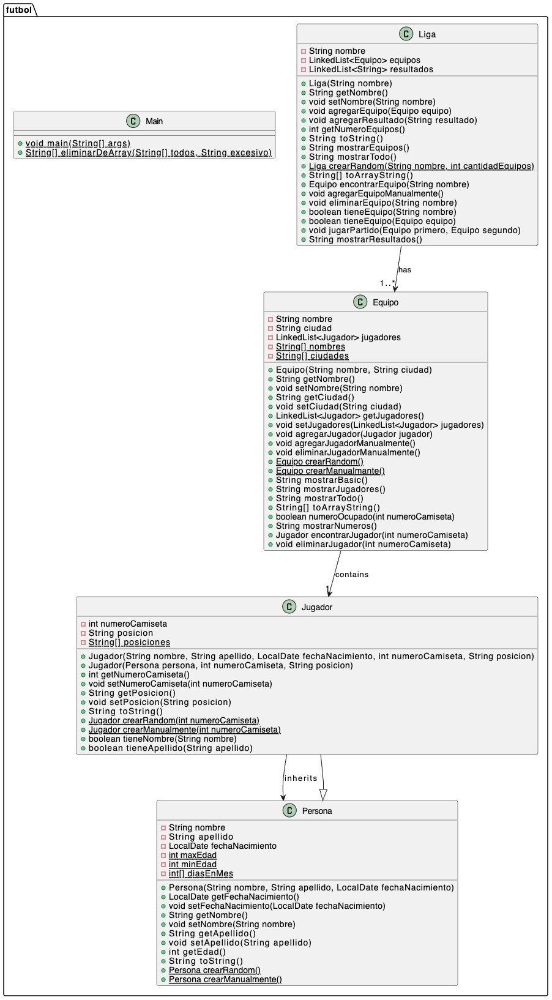

<!DOCTYPE html>
<html lang="es">
<head>
    <meta charset="UTF-8">
    <meta name="viewport" content="width=device-width, initial-scale=1.0">
</head>
<body>
    <h1>Trabajo Práctico 1 de Programación orientadada a objetos</h1>
    
    
Un modelo de sistema de gestión de equipos de fútbol utilizando programación orientada a objetos en Java.

    
Alumnos: Mikhail Piataev, Evgenii Mikheev

    
Profesor: Gamaliel Natanael Quiroz

</body>
</html>
